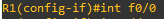
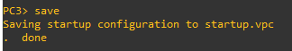

# Redes1-Practica2_201610673

Se debe configurar y administrar los dispositivos de una infraestructura de red. La empresa tiene operando 6 máquinas, administradas en 3 subredes;
* 2 en el área de finanzas
* 3 en el área de ventas 
* 1 virtual en el área de Informática. 

### Topología de red 

### Pasos para crear la topología

1. Agregar un router 
    
 
2. Agregar los switch 
 

3. Agregar las vpc
 

4. Agregar la máquina virtual linux 
  

5. Agregar una interfaz al router 
 

6. Irse a la sección de slots y seleccionar configuración 
   

Para poder conectarlos
   

## Configuraciones para la topología de Red 
  A continuación se detalla cada uno de los comandos necesarios para realizar la configuración de cada uno de los dispositivos que conforman la topología de red 

### Router 
  1. Comando para acceder a la configuración de la terminal 
      * configure terminal 
  
  2. Comando para acceder a la interfaz fastEthernet 0/0
      * int f0/0

     
  
  3. Comando para configurar la ip del router 
       * ip address 192.168.10.1 255.255.255.192
   
       
  
  4. Comando para activar la interfaz
       * no shutdown
   
      
  
  5. Salir de la interfaz fastEthernet 0/0
       * Exit 
   
      
  
  6. Comando para acceder al fastEthernet 0/1
       * int f0/1
      
      
  
  7. Comando para configurar la ip del router 
        * ip address 192.168.10.65 255.255.255.192
      
      
  
  8. Comando para activar la interfaz
        * no shutdown
     
        
  
  9. Salir de fastEthernet 0/1
       * Exit 
    
       
   
  10. Comando para acceder al fastEthernet 1/0
       * int f1/0
          
        
  
  11. Comando para configurar la ip del router 
       * ip address 192.168.10.129 255.255.255.192
      
       
  
  12. Comando para activar la interfaz
       * no shutdown
     
      
  
  13. Salir de las configuraciones
       * exit 
      
      
  
  14. Guardar los cambios 
        * wr 
       
       
  
  15. Para mostrar la información de las interfaces
         * show ip interface brief
       
        
  
### VPC1
  1. Comando para configurar la ip 
      * ip 192.168.10.2/26 192.168.10.1
   
      
  
  2. Para mostrar la configuración de ip y máscara de red 
      * sh ip 
  
      
  
  3. Para guardar los cambios 
      * save 
  
     

### VPC2
  1. Comando para configurar la ip 
      * ip 192.168.10.3/26 192.168.10.1
   
     
  
  2. Para mostrar la configuración de ip y máscara de red 
      * sh ip 
  
     
  
  3. Para guardar los cambios 
      * save 
  
      

### VPC3
  1. Comando para configurar la ip 
      * ip 192.168.10.66/26 192.168.10.65
   
     
  
  2. Para mostrar la configuración de ip y máscara de red 
      * sh ip 
  
     
  
  3. Para guardar los cambios 
      * save 
  
     

### VPC4
  1. Comando para configurar la ip 
      * ip 192.168.10.67/26 192.168.10.65
   
     
  
  2. Para mostrar la configuración de ip y máscara de red 
      * sh ip 
  
     
  
  3. Para guardar los cambios 
      * save 
  
     

### VPC5
  1. Comando para configurar la ip 
      * ip 192.168.10.68/26 192.168.10.65
   
     
  
  2. Para mostrar la configuración de ip y máscara de red 
      * sh ip 
  
     
  
  3. Para guardar los cambios 
      * save 
  
     

### linux-1
 1.  Entrar al panel de control y seleccionar Network 
  
     
  
 2. Ingresar la siguiente ip, gateway, máscara de red 
    
      
  
3. Aplicar y Salir 

4. Abrir la terminal 
   Comando para mostrar la configuración 
      * ifconfig 
   
        
   
### Comprobar  el estado de la conexión 
  ping ip 
        * ping 192.168.10.2
        * ping 192.168.10.3
        * ping 192.168.10.66
        * ping 192.168.10.67
        * ping 192.168.10.68
        * ping 192.168.10.130
  
   
  
  
    
