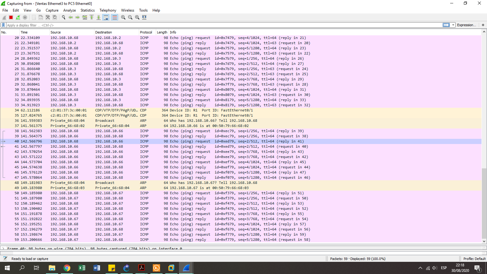

# Manual de Reporte

### Dominio de broadcast y dominio de colisión 

Para poder realizar los cálculos es necesario considerar lo siguiente:
* Hub : 1 dc
        1 db 
        
* Switch: n dc (n = # de puertos conectados)
          1 db
          
* Router: 1db 
          1dc 
        (por cada interfaz conectada)
        
        
 Realizando los calculos de nuestra topología de red, obtenemos 9DC y 3 DB 
 

### Captura de paquetes

1. Posicionarse en el enlace entre el switch y la vpc 
     

2. Seleccionar "start capture"
    

3. Ping de la vpc a las otras maquinas

4. AL dar click en ok, se abrira el programa wireshark

## VP1
    
    
## VP2
   

## VP3
  

## VP4
  
  
## VP5
  
  
## Tiny Linux 
  
